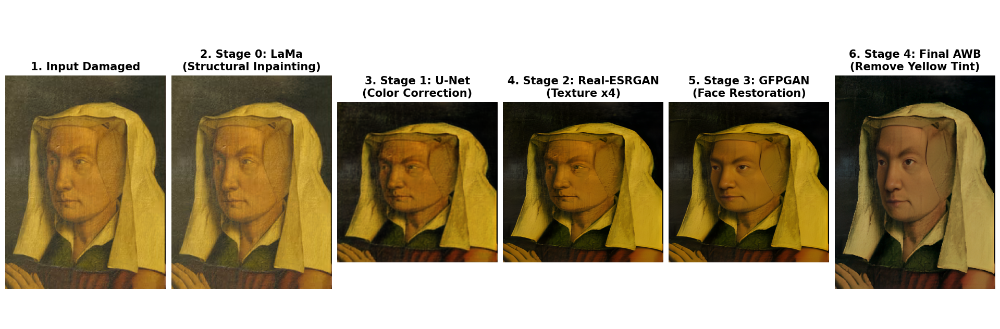

# 🎨 Reversing Time: AI Art Restoration Pipeline


A memory-optimized, multi-stage AI inference pipeline designed to sequentially repair, color-correct, and upscale heavily degraded classical artwork on standard consumer hardware.



---

# 📖 Overview

Historical art suffers from centuries of degradation, including:

- Physical canvas tears
- UV bleaching
- Severe varnish oxidation (yellowing)

This project addresses these issues not as a single task, but as a sequential assembly line of specialized neural networks.

By utilizing aggressive VRAM management techniques such as:

- Automatic Mixed Precision (AMP)
- Tiled inference
- Sequential computational graph destruction

the pipeline successfully runs **four massive state-of-the-art models on a standard 6GB consumer GPU.**

---

# ⚙️ The Multi-Model Architecture

The pipeline processes images sequentially through four distinct stages:

---

## Stage 0: Structural Inpainting (LaMa)

### Purpose
Seamlessly patches massive physical gaps, tears, and deep canvas cracks.

### Engineering
Implements a custom mathematical tiling function:

- `512x512` tiles
- `32px` overlap

This bypasses spatial memory limits during high-resolution processing.

---

## Stage 1: Color & Light Correction (Custom U-Net)

### Purpose
Reverses varnish oxidation and UV fading.

### Engineering
Custom-trained **ResNet34 U-Net** utilizing a balanced combination of:

- **L1 Loss** → pixel-level color accuracy
- **VGG19 Perceptual Loss** → preserves authentic brushstroke textures

---

## Stage 2: Super-Resolution (Real-ESRGAN)

### Purpose
Upscales the repaired image by **400%**, hallucinating:

- fine-grained textures
- canvas grain
- artistic details

### Engineering
Features:

- 100% offline inference with bundled weights
- fallback resolution handling

---

## Stage 3: Semantic Face Restoration (GFPGAN)

### Purpose
Selectively reconstructs facial geometry using **Generative Facial Priors** to ensure human features remain structurally sound.

---

## Stage 4: Deterministic Post-Processing

### Purpose
Applies:

- Auto White Balance in the **CIELAB** color space
- **Lanczos4 interpolation** for crispness

---

# 🚀 Setup & Installation

## 1. Clone the Repository

```bash
git clone https://github.com/devraj-1234/ArtiFact.git
cd AI-Art-Restoration
```

---

## 2. Create a Virtual Environment

### Linux / macOS

```bash
python -m venv venv
source venv/bin/activate
```

### Windows

```powershell
python -m venv venv
venv\Scripts\activate
```

---

## 3. Install Dependencies

```bash
pip install -r requirements.txt
```

---

# 📦 Model Weights Download

To run the pipeline entirely offline and avoid third-party server timeouts, all required model weights (Custom U-Net, Real-ESRGAN, and GFPGAN) have been bundled into a single archive.

1. Download the complete weights package here: `https://drive.google.com/file/d/1JoA9iQBqHhYZbaEuDCD7rWvqbp8SJLle/view?usp=sharing`
2. Extract the `.zip` file directly into the root directory of this repository.

---

# 📁 Project Structure

Ensure your directory structure looks exactly like this before running inference:

```text
AI_Art_Restoration/
├── assets/
│   └── sample_damaged.jpg
├── checkpoints/
│   ├── best_unet_resnet34_perceptual.pth
│   ├── realesrgan/
│   │   └── RealESRGAN_x4plus.pth
│   └── gfpgan/
│       └── GFPGANv1.3.pth
├── gfpgan/
│   └── weights/
│       ├── detection_Resnet50_Final.pth
│       └── parsing_parsenet.pth
├── src/
├── final_inference.py
└── README.md

---

# 💻 Usage

## 1. Add a Damaged Artwork

Place a damaged historical image inside the `assets/` folder and name it:

```text
sample_damaged.jpg
```

---

## 2. Run the Inference Pipeline

```bash
python final_inference.py
```

---

## 3. Output

The script will:

- print terminal logs showing VRAM allocation
- visualize all restoration stages using Matplotlib

---

# 📊 Evaluation & Metrics

The pipeline utilizes **Scikit-Image** for rigorous mathematical evaluation against pristine ground-truth data.

Ground truth images are synthetically degraded during training.

---

## PSNR (Peak Signal-to-Noise Ratio)

Measures pixel-perfect restoration accuracy.

---

## SSIM (Structural Similarity Index)

Ensures structural and textual integrity of:

- canvas geometry
- brushstrokes
- fine artistic textures

---

# 🧠 Key Engineering Features

- Memory-optimized inference pipeline
- Sequential GPU graph destruction
- Tiled high-resolution restoration
- Mixed precision inference
- Modular multi-stage architecture
- Fully offline, zero-dependency runtime
- Consumer GPU compatibility

---

# 📚 Acknowledgments & References

This project stands on the shoulders of incredible open-source research.

---

## LaMa

Suvorov et al.

> *Resolution-Robust Large Mask Inpainting with Fourier Convolutions*  
> WACV 2022

---

## Real-ESRGAN

Wang et al.

> ICCVW 2021

---

## GFPGAN

Wang et al.

> *Towards Real-World Blind Face Restoration*  
> CVPR 2021

---

## U-Net

Ronneberger et al.

> MICCAI 2015

---

# 📜 License

This project is licensed under the MIT License.
